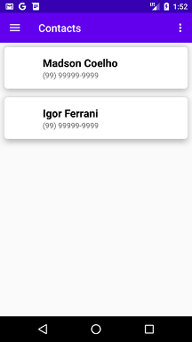
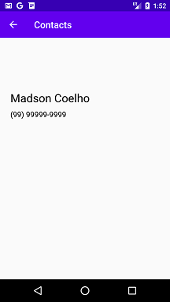

# Contacts
Projeto desenvolvido no curso "Conceitos de navegação, aparência e estilo de aplicativos Android" do Bootcamp everis Kotlin Developer da [Digital Innovation One](https://digitalinnovation.one).

Este aplicativo é uma lista de contatos que introduz alguns conceitos importantes do Android. Os principais conceitos apresentados são: Recycler View, Card View, Options Menus, Navigation Drawer, Shared Preferences.

## Instruções
Faça o clone ou o download do projeto no seu computador e execute o aplicativo no Android Studio.

## Screenshots

